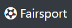
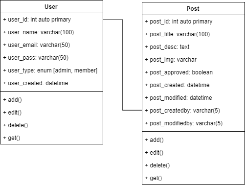
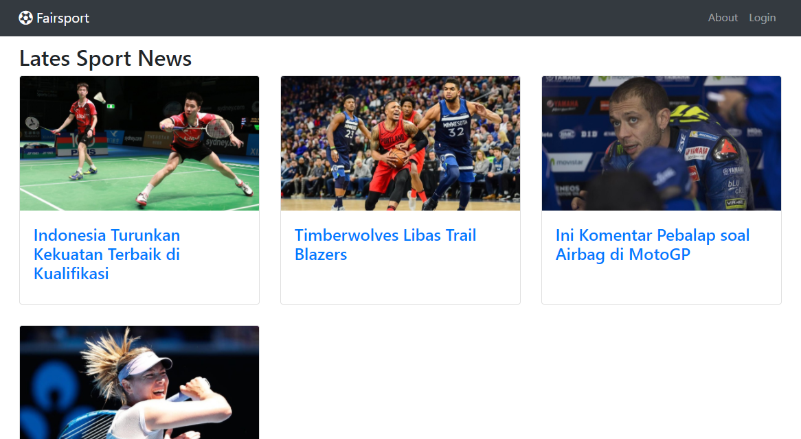
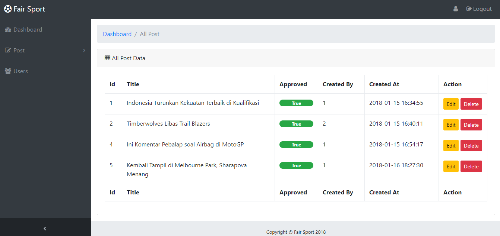

# Fairsport



Fairsport is a news portal build with Codeigniter and MySQL focused on how CRUD work in real scenario.

## Database Diagram



## Getting Started
These instructions will get you a copy of the project up and running on your local machine for development and testing purposes.

## Prerequisite
Before you clone this project make sure you already have anything needed to run this project.

```
    XAMPP / LAMPP
    Code Editor (VS Code, Sublime etc)

    A cup of tea / coffee :D
```

## Installing
Please follow this step to make project run well in your local development.

```
    git clone git@github.com:fuadajip/fairsport.git
```

Create uploads folder into root dir of project
```
    mkdir your_path/fairsport/uploads
```

Create a MySQL database named fairsport through phpmyadmin or sql command via terminal
```
    create database fairsport;
```

Running migration for fairsport database table, please visit this link below
```
    localhost/fairsport/migrate
```
Migration process will create users and posts table in fairsport database


## Running the test

Test if everything run well
```
    localhost/fairsport
```

To registering new user visit this local url
```
    localhost/fairsport/signup
```

## Author
Fuad Aji Pratomo

## License
This project is licensed under the Apache-2.0    License - see the [LICENSE.md](https://github.com/fuadajip/fairsport/blob/master/LICENSE) file for details


## Output



---


